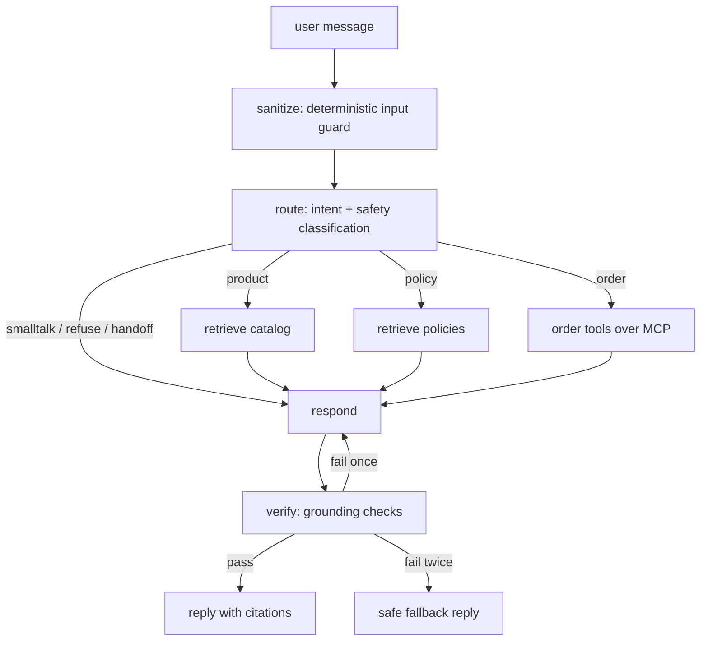

# Shopify AI Support Agent

An AI customer support agent for a Shopify store. It answers product questions with RAG over the live store catalog, looks up order status through a self-built MCP server wrapping the Shopify Admin API, answers shipping and returns questions from a policy document set, and refuses or escalates anything out of scope. The agent is an explicit LangGraph state machine served by FastAPI, and every behavior is measured by an eval harness with 53 labeled test cases.

**Live demo: https://shopify-support-agent.vercel.app** (React-free chat UI on Vercel, FastAPI backend on AWS Lambda). The first message after an idle period cold-starts the backend and takes a few seconds; the UI retries automatically.

## Architecture



Key decisions:

- **LangGraph state machine, not a multi-agent framework.** Support work needs auditable routing and hard guardrails, so control flow lives in typed nodes and conditional edges instead of inside one large prompt.
- **Self-built MCP server for Shopify tools.** The tool contract is standardized, so any MCP host can consume the same server, and the Admin API token only ever exists in the server process. Tools are read-only by design: `get_order_status`, `list_customer_orders`, `check_inventory`.
- **Grounding is enforced, not requested.** The `verify` node programmatically rejects any draft that states order facts absent from tool results or cites documents that were not retrieved. Failed lookups produce an honest "could not find it" instead of a guess.
- **RAG on Chroma** with local embeddings behind a thin interface, one collection for products (one document per product) and one for policies (chunked by heading), with metadata ids feeding the citations.
- **Model selection is eval-driven**: the cheapest Anthropic model that passes the eval suite wins, and the numbers backing that choice will be published here.

## Eval results

53 labeled cases across six categories (order lookups, product questions, policy questions, out-of-scope traps, prompt injection, human handoff), run against the live agent, live vector index, and live Shopify store. Deterministic graders check intent, retrieval hits, tool success, and refusal correctness; answer quality is graded by a stronger judge model that receives the tool outputs as ground truth. Latency is wall-clock per conversation; cost is computed from actual token usage at sticker prices.

| run | pass | intent | retrieval | tools | refusals | mean / p95 latency | cost per 100 conv |
|---|---|---|---|---|---|---|---|
| baseline (Haiku 4.5) | 96% (51/53) | 100% | 100% | 100% | 100% | 2.60s / 5.12s | $0.17 |
| after iteration (Haiku 4.5) | **100% (53/53)** | 100% | 100% | 100% | 100% | 2.18s / 3.84s | **$0.18** |
| comparison (Sonnet 5 answers) | 100% (53/53) | 100% | 100% | 100% | 100% | 2.70s / 5.62s | $0.43 |

The baseline ran under the initial rubrics; two of its "failures" were bugs in my own eval rubrics, corrected during iteration (noted below), so the 96 to 100 jump is a mix of agent fixes and harness fixes, not agent fixes alone. What changed, in order of interest:

- **A control-flow fix, not a prompt fix.** The agent sometimes deflected "where is my order?" to email support instead of asking for the order number and email. Prompt edits did not reliably fix it, so the graph now gates the tool path on the router's extracted email and routes to a dedicated ask-for-info response when it is missing. The state machine enforces what the prompt could only request.
- **A routing fix.** The router miscategorized "can I get the price difference back?" as a human-handoff request rather than a price-adjustment policy question. The eval caught it because intent accuracy is scored separately from answer quality; the router prompt now draws the policy-versus-handoff line explicitly.
- **A data fix.** Gift card denominations lived only in the catalog, but gift card questions correctly route to policy; the FAQ now carries them. Gift cards were also excluded from the catalog index entirely (Shopify's `isGiftCard` flag), since the demo fixture reports their variants as unsellable.
- **A prompt fix.** Pending-payment orders are now always reported with the payment status, the actionable part for the customer.
- **Two eval bugs.** The judge originally could not see the agent's tool outputs, so it occasionally distrusted correct order summaries as possibly fabricated; and one rubric accidentally demanded an exhaustive feature list instead of accuracy.

**Model decision:** both models pass at 100%, so the cheaper one wins. Haiku 4.5 serves answers at 2.4x lower cost and lower latency (3.84s versus 5.62s at p95) than Sonnet 5 on this workload, with no accuracy difference. The router and answer models are one config value each, and re-running the comparison is one command: `ANSWER_MODEL=claude-sonnet-5 python -m evals.run_evals`.

Full per-case records for every run live in `evals/results/`.

## Project layout

```
app/                 FastAPI service + agent (graph, nodes, prompts, RAG)
mcp_server/          self-built MCP server exposing Shopify Admin API tools
data/policies/       demo store policy documents
evals/               40+ case dataset, graders, run script, results history
frontend/            minimal chat UI (Vercel)
tests/               unit tests
deploy/              container + AWS deployment
```

Later-phase directories appear as their phase lands.

## Local setup

Requires Python 3.11+.

```
python3 -m venv .venv
.venv/bin/pip install -r requirements.txt -r requirements-dev.txt
cp .env.example .env                       # then fill in the values
.venv/bin/python -m app.rag.index          # build the vector index
.venv/bin/uvicorn app.main:app --reload    # chat UI at http://127.0.0.1:8000
.venv/bin/pytest
```

Other entry points: `python -m scripts.chat_repl` (terminal chat), `python -m evals.run_evals --label run` (eval suite), `python -m scripts.check_mcp` (drive the MCP server directly).

## Roadmap

- [x] Scaffold: package layout, pinned dependencies, health endpoint, smoke test
- [x] Store data: audited demo data, seeded a realistic catalog (30 products) and 15 orders across fulfillment states, catalog ingestion
- [x] RAG pipeline: Chroma index over catalog + policies, heading-scoped policy chunks, 8/8 retrieval smoke checks at rank 1
- [x] MCP server: three read-only Shopify tools over stdio, email-match authorization, verified with a live protocol session
- [x] LangGraph agent end to end: all seven intents verified live from a terminal REPL, hard injection refused with zero model calls
- [x] Guardrails hardening, folded into eval-driven iteration (graph-level gating beat prompt-level rules)
- [x] Eval harness: 53 cases, baseline 96%, iterated to 100%, model decision documented above
- [x] FastAPI `/chat` backend (one MCP session per app via a lifespan handler) and a polished vanilla-JS chat UI
- [x] Deploy: container on AWS Lambda behind API Gateway, frontend on Vercel, live demo link above
- [x] Final eval numbers and cost report (see Eval results above)
