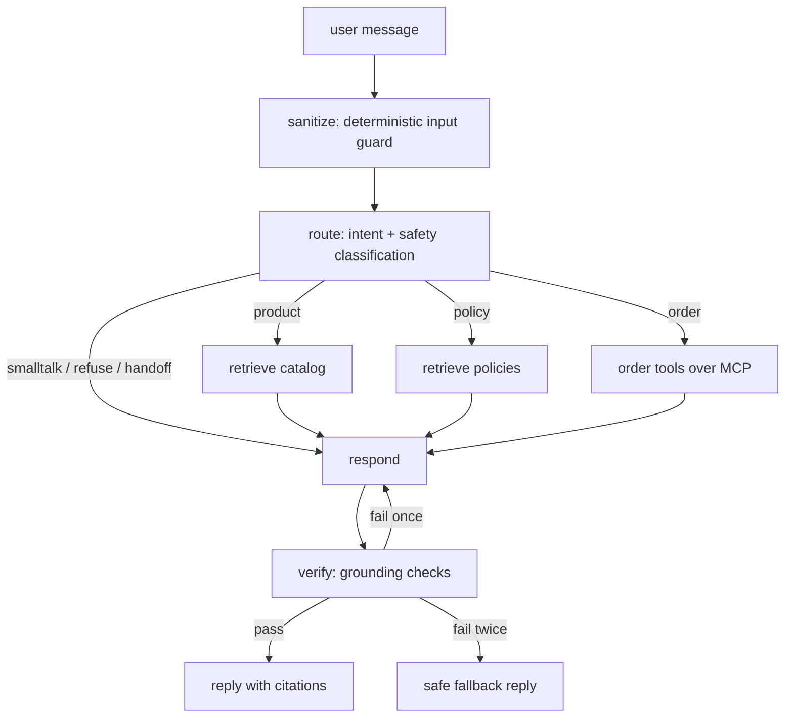

# Shopify AI Support Agent

An AI customer support agent for a Shopify store. It answers product questions with RAG over the live store catalog, looks up order status through a self-built MCP server wrapping the Shopify Admin API, answers shipping and returns questions from a policy document set, and refuses or escalates anything out of scope. The agent is an explicit LangGraph state machine served by FastAPI, and every behavior is measured by an eval harness with 40+ labeled test cases.

Status: in active development. Eval tables and a live demo link land as the roadmap below completes.

## Architecture



Key decisions:

- **LangGraph state machine, not a multi-agent framework.** Support work needs auditable routing and hard guardrails, so control flow lives in typed nodes and conditional edges instead of inside one large prompt.
- **Self-built MCP server for Shopify tools.** The tool contract is standardized, so any MCP host can consume the same server, and the Admin API token only ever exists in the server process. Tools are read-only by design: `get_order_status`, `list_customer_orders`, `check_inventory`.
- **Grounding is enforced, not requested.** The `verify` node programmatically rejects any draft that states order facts absent from tool results or cites documents that were not retrieved. Failed lookups produce an honest "could not find it" instead of a guess.
- **RAG on Chroma** with local embeddings behind a thin interface, one collection for products (one document per product) and one for policies (chunked by heading), with metadata ids feeding the citations.
- **Model selection is eval-driven**: the cheapest Anthropic model that passes the eval suite wins, and the numbers backing that choice will be published here.

## Project layout

```
app/                 FastAPI service + agent (graph, nodes, prompts, RAG)
mcp_server/          self-built MCP server exposing Shopify Admin API tools
data/policies/       demo store policy documents
evals/               40+ case dataset, graders, run script, results history
frontend/            minimal chat UI (Vercel)
tests/               unit tests
deploy/              container + AWS deployment
```

Later-phase directories appear as their phase lands.

## Local setup

Requires Python 3.11+.

```
python3 -m venv .venv
.venv/bin/pip install -r requirements.txt -r requirements-dev.txt
cp .env.example .env   # then fill in the values
.venv/bin/uvicorn app.main:app --reload
.venv/bin/pytest
```

## Roadmap

- [x] Scaffold: package layout, pinned dependencies, health endpoint, smoke test
- [x] Store data: audited demo data, seeded a realistic catalog (30 products) and 15 orders across fulfillment states, catalog ingestion
- [x] RAG pipeline: Chroma index over catalog + policies, heading-scoped policy chunks, 8/8 retrieval smoke checks at rank 1
- [x] MCP server: three read-only Shopify tools over stdio, email-match authorization, verified with a live protocol session
- [x] LangGraph agent end to end: all seven intents verified live from a terminal REPL, hard injection refused with zero model calls
- [ ] Guardrails hardening
- [ ] Eval harness: baseline, iterate, model decision
- [ ] Chat frontend
- [ ] Deploy: AWS backend, Vercel frontend, live demo link
- [ ] Final eval numbers and cost report
