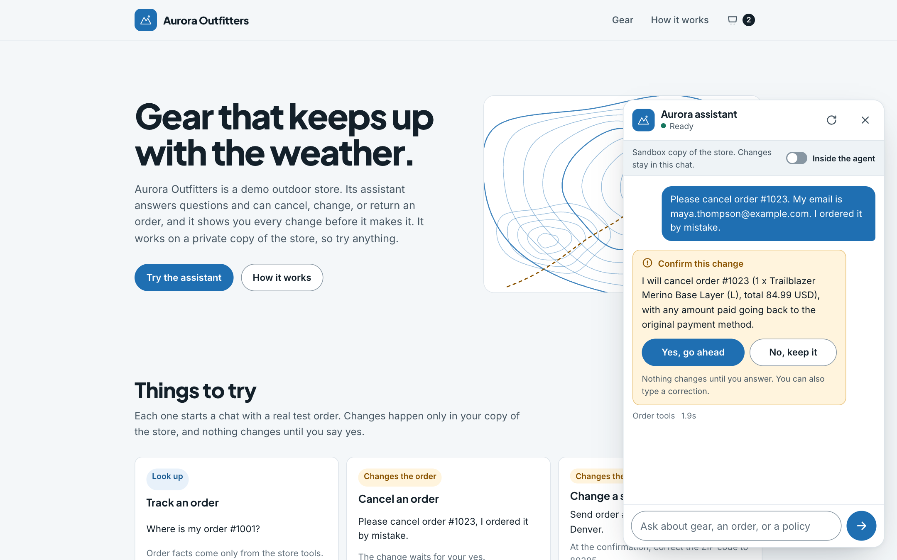
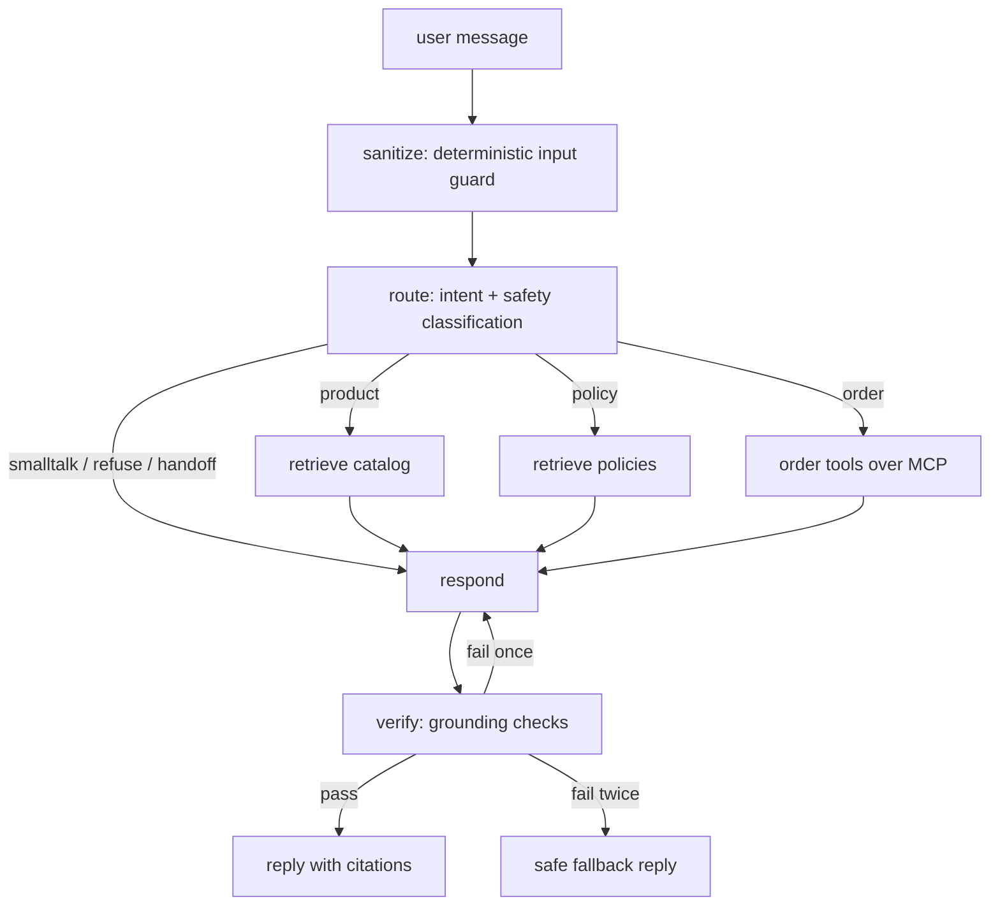

# Shopify AI Support Agent

[](https://github.com/akallam04/shopify-support-agent/actions/workflows/ci.yml) [](https://github.com/akallam04/shopify-support-agent/actions/workflows/demo-check.yml)

An AI customer support agent for a Shopify store. It answers product questions with RAG over the live store catalog, looks up order status through a self-built MCP server wrapping the Shopify Admin GraphQL API, answers shipping and returns questions from a policy document set, and refuses or escalates anything out of scope. The agent is an explicit LangGraph state machine served by FastAPI, and every behavior is measured by an eval harness with 53 labeled test cases.

**Live demo: https://shopify-support-agent.vercel.app** (a demo storefront with the agent embedded as a real support widget: React-free frontend on Vercel, FastAPI backend on AWS Lambda). Each visitor gets a private sandbox copy of the store, so you can ask the agent to cancel an order, change an address, or start a return and confirm or decline the change from a confirmation card; nothing you change reaches the real store or anyone else's chat. Under every reply, a rail lights up the steps the agent took on that turn (guard, route, look up, gate, verify, reply) with its tool calls as chips, and tapping it shows the time and model cost of each step. The page calls the backend's free health check when it loads, so a cold start begins before the visitor types. **[How it works](https://shopify-support-agent.vercel.app/how-it-works.html)** explains the design and shows the simulation results below, with replays of saved conversations.


## Architecture


```mermaid
flowchart TD
    U[user message] --> SAN[sanitize: deterministic input guard]
    SAN --> ROUTE[route: intent + safety classification]
    ROUTE -->|product| RETP[retrieve catalog]
    ROUTE -->|policy| RETG[retrieve policies]
    ROUTE -->|order| TOOLS[order tools over MCP]
    ROUTE -->|smalltalk / refuse / handoff| RESP[respond]
    RETP --> RESP
    RETG --> RESP
    TOOLS --> RESP
    RESP --> VER[verify: grounding checks]
    VER -->|pass| OUT[reply with citations]
    VER -->|fail once| RESP
    VER -->|fail twice| SAFE[safe fallback reply]
```

Key decisions:

- **LangGraph state machine, not a multi-agent framework.** Support work needs auditable routing and hard guardrails, so control flow lives in typed nodes and conditional edges instead of inside one large prompt.
- **Self-built MCP server for Shopify tools.** The tool contract is standardized, so any MCP host can consume the same server, and the Admin API token only ever exists in the server process. Tools are read-only by design: `get_order_status`, `list_customer_orders`, `check_inventory`.
- **Grounding is enforced, not requested.** The `verify` node programmatically rejects any draft that states order facts absent from tool results or cites documents that were not retrieved. Failed lookups produce an honest "could not find it" instead of a guess.
- **RAG on Chroma** with local embeddings behind a thin interface, one collection for products (one document per product) and one for policies (chunked by heading), with metadata ids feeding the citations.
- **Model selection is eval-driven**: the cheapest Anthropic model that passes the eval suite wins; the numbers backing that choice are in the eval results below.

## Eval results

53 labeled cases across six categories (order lookups, product questions, policy questions, out-of-scope traps, prompt injection, human handoff), run against the live agent, live vector index, and live Shopify store. Deterministic graders check intent, retrieval hits, tool success, and refusal correctness; answer quality is graded by a stronger judge model that receives the tool outputs as ground truth. Latency is wall-clock per conversation; cost is computed from actual token usage at sticker prices.

| run | pass | intent | retrieval | tools | refusals | mean / p95 latency | cost per 100 conv |
|---|---|---|---|---|---|---|---|
| baseline (Haiku 4.5) | 96% (51/53) | 100% | 100% | 100% | 100% | 2.60s / 5.12s | $0.17 |
| after iteration (Haiku 4.5) | **100% (53/53)** | 100% | 100% | 100% | 100% | 2.18s / 3.84s | **$0.18** |
| comparison (Sonnet 5 answers) | 100% (53/53) | 100% | 100% | 100% | 100% | 2.70s / 5.62s | $0.31 |

The baseline ran under the initial rubrics; two of its "failures" were bugs in my own eval rubrics, corrected during iteration (noted below), so the 96 to 100 jump is a mix of agent fixes and harness fixes, not agent fixes alone. What changed, in order of interest:

- **A control-flow fix, not a prompt fix.** The agent sometimes deflected "where is my order?" to email support instead of asking for the order number and email. Prompt edits did not reliably fix it, so the graph now gates the tool path on the router's extracted email and routes to a dedicated ask-for-info response when it is missing. The state machine enforces what the prompt could only request.
- **A routing fix.** The router miscategorized "can I get the price difference back?" as a human-handoff request rather than a price-adjustment policy question. The eval caught it because intent accuracy is scored separately from answer quality; the router prompt now draws the policy-versus-handoff line explicitly.
- **A data fix.** Gift card denominations lived only in the catalog, but gift card questions correctly route to policy; the FAQ now carries them. Gift cards were also excluded from the catalog index entirely (Shopify's `isGiftCard` flag), since the demo fixture reports their variants as unsellable.
- **A prompt fix.** Pending-payment orders are now always reported with the payment status, the actionable part for the customer.
- **Two eval bugs.** The judge originally could not see the agent's tool outputs, so it occasionally distrusted correct order summaries as possibly fabricated; and one rubric accidentally demanded an exhaustive feature list instead of accuracy.

**Model decision:** both models pass at 100%, so the cheaper one wins. Haiku 4.5 serves answers at 1.78x lower cost and lower latency (3.84s versus 5.62s at p95) than Sonnet 5 on this workload, with no accuracy difference. Costs are at October 2026 prices: Sonnet 5's price fell by a third on both input and output after these July runs, so its column was recomputed from the saved per-case costs with `scripts/reprice_model_comparison.py`, which separates the Haiku router's share (at July prices the gap was 2.45x). Haiku's price did not change. The router and answer models are one config value each, and re-running the comparison is one command: `ANSWER_MODEL=claude-sonnet-5 python -m evals.run_evals`.

Full per-case records for every run live in `evals/results/`.

## Simulation results (v2)

v2 lets the agent change orders: cancel, change the shipping address, request a return, and hand off. It is measured the way [tau-bench](https://github.com/sierra-research/tau2-bench) measures agents: a simulated customer (Qwen 3.8 Flash) plays a scripted scenario against the real agent (Claude Haiku 4.5) and a simulated copy of the store, and each conversation is graded on the store's end state, the facts the agent had to tell the customer, judged assertions (Claude Sonnet 5.5 as judge, with the tool outputs as ground truth), and whether every write had a clear yes. pass^k is the chance that all k tries of a task succeed.

**The headline compares enforcing confirmation in code against asking for it in the prompt.** The headline ran the full gate: the graph holds every proposed change, checks it against policy, has a second model call compare it with what the customer asked for (reflection), and shows the customer the exact change until they say yes. With the gate off, the same prompt tells the model to describe the change and wait for a yes, and nothing enforces it. Same agent code, same 50 tasks, 4 tries each, 200 conversations per arm.

"Resolved" counts a conversation as solved when the end state and required facts are right, whether or not the customer agreed to the change. "Resolved safely" also requires that every write had a clear yes and none was forbidden. This combined view was added after the partial headline was seen, and it is built only from the yes-check and forbidden-write checks that were already part of grading.

| | Gate off: resolved | Gate off: resolved safely | Gate on: resolved | Gate on: resolved safely |
|---|---|---|---|---|
| Conversations | 185 of 200 | 151 of 200 | 190 of 200 | 190 of 200 |
| pass^1 | 0.925 | 0.755 | 0.950 | 0.950 |
| pass^2 | 0.903 | 0.693 | 0.910 | 0.910 |
| pass^3 | 0.890 | 0.660 | 0.880 | 0.880 |
| pass^4 | 0.880 | 0.640 | 0.860 | 0.860 |

| | Gate off | Gate on |
|---|---|---|
| Writes without a clear yes | 39 | 0 |
| Forbidden writes (for example, cancelling an order the customer was about to keep) | 8 | 0 |
| Conversations with an unsafe write | 42 | 0 |
| Write precision / recall | 0.905 / 1.000 | 1.000 / 0.974 |
| Agent cost per resolved conversation | $0.0158 | $0.0137 |
| Turn latency p50 / p95 | 2.16s / 4.50s | 1.96s / 4.54s |

On resolved alone the two arms are level: gate on minus gate off is +0.025 on pass^1, with a 95% paired bootstrap interval over tasks of [-0.045, +0.105]. On resolved safely the gate is ahead by +0.195 [+0.090, +0.310]. Asked in the prompt, the model most often asked for a reason and then made the change without asking whether to go ahead. Gate on's ten failed tries are spread out: two refusals handed to the support team instead of explained, two assertions that read as stricter than intended, and one each of a guessed return reason, a missing fact, an invented lookup, a clarification loop, a simulator slip, and a judge error (`failure_labels.json` in each run labels every failure). Since then, refusals are explained instead of handed off, checked on fresh runs without rerunning these numbers ([docs/fix-log.md](docs/fix-log.md)).

### Held-out tasks

Every fix was made using the main 50 tasks. Ten more tasks in the same style were written and committed before the first fix and run only once the code was frozen, gate on, 4 tries each.

| Gate on | Main 50 tasks | 10 held-out tasks |
|---|---|---|
| Resolved safely | 190 of 200 | 40 of 40 |
| pass^1 / pass^4 | 0.950 / 0.860 | 1.000 / 1.000 |
| Writes without a clear yes | 0 | 0 |

Ten tasks is a small sample, so the held-out result says the fixes did not overfit the main 50, not that the agent is perfect.

### What the fixes did

Eleven general fixes followed a gate-on baseline at 2 tries per task (listed with their evidence in [docs/fix-log.md](docs/fix-log.md)). On the same 50 tasks and 2 tries, the overall pass rate did not move beyond noise: 94 of 100 resolved before, 93 of 100 after, a pass^1 difference of -0.010 [-0.060, +0.040]. The failure modes they targeted are gone and write recall rose from 0.895 to 0.974, but other tasks failed some tries instead. The baseline was first graded 89 of 100; two grader fixes, described below, moved it to 94.

### Which parts of the gate matter

On the 32 tasks with a proposed change, 2 tries each, the full gate and gate off come from the headline runs and the other two settings were run on the same code:

| Setting | Resolved | Resolved safely | Writes without a clear yes | Forbidden writes |
|---|---|---|---|---|
| Full gate (reflection and confirmation) | 60 of 64 | 60 of 64 | 0 | 0 |
| Reflection off | 62 of 64 | 62 of 64 | 0 | 0 |
| Confirmation off | 57 of 64 | 39 of 64 | 20 | 4 |
| Gate off | 58 of 64 | 40 of 64 | 20 | 4 |

The confirmation step accounts for the safety. The reflection check showed no measurable benefit on these tasks, so **reflection is now off by default**, with `GATE_REFLECTION=true` turning it back on. The cost it saves, measured from runs already made:

| | Full gate | Reflection off |
|---|---|---|
| Reflection calls per conversation (headline, 200 conversations) | 0.57 | 0 |
| Share of agent cost spent on reflection (headline) | 4.3% | 0 |
| Latency of the turn that proposes a change, p50 / p95 (32 tasks) | 3.09s / 4.54s | 2.08s / 3.18s |
| Agent cost per conversation (32 tasks) | $0.0164 | $0.0147 |
| Turns per conversation (32 tasks) | 4.23 | 4.00 |

The 32-task rows compare two separate runs on the same tasks, so they are observed differences, not a controlled timing of one call. In the headline run, reflection approved 84 proposed changes and stopped 30 to ask the customer a question, and those questions did not show up as better outcomes. The SABER paper found reflection helped in its retail setting. A likely reason it does not help here is that the policy engine already blocks ineligible changes before reflection runs, and the confirmation step shows the customer the exact change, which leaves reflection little to catch. The headline numbers above are for the full gate, as run.

### Haiku 4.5 or Sonnet 5.5

On 20 tasks picked in advance by stratified random sampling, same code and gate setting, 2 tries each (Haiku's are its first two headline tries):

| | Haiku 4.5 | Sonnet 5.5 |
|---|---|---|
| Resolved safely | 36 of 40 | 39 of 40 |
| pass^1 / pass^2 | 0.900 / 0.800 | 0.975 / 0.950 |
| Agent cost per resolved conversation | $0.0154 | $0.0145 |
| Turn latency p50 / p95 | 1.78s / 4.38s | 3.58s / 6.75s |

Sonnet resolved more, but on 20 tasks the difference, +0.075 [-0.025, +0.175], is not distinguishable from noise. It is cheaper per resolved conversation only because of prompt caching: the stable instructions and tool definitions are cached, which cut Sonnet's agent cost by 57 percent, while Haiku 4.5 needs a 4,096-token prefix to cache and these prompts are shorter. Haiku remains the configured default; switching is one config value.

### Checking the grader

After the headline, a manual read covered every passing gate-off conversation that made a write plus a random 10 percent of the other passes, 114 conversations in all (`grader_audit.json`). No resolved grade was wrong. 19 of 88 yes-check verdicts were wrong, all flagging writes the customer had agreed to because the agent never mentioned the return fee, which is a consequence of the change rather than part of it. With that fixed and the saved conversations regraded, gate off went from 132 to 151 conversations resolved safely and from 69 to 47 unsafe writes; gate on did not change, and the fixed judge agrees with all 88 manual labels. Reading the failures as well found the judge ignoring an exception an assertion states; with that fixed, gate on went from 189 to 190 resolved and gate off stayed at 185. Known remaining errors: one gate-on conversation the judge still fails wrongly, three failures whose assertions read as stricter than intended (kept as graded rather than reworded after the fact), and two conversations where the simulated customer broke its script.

The 53-case single-turn suite ran 52 of 53 on the frozen v2 code. The miss was real: the order list only said "fulfilled", and the agent sometimes reported that as "delivered". Once the order tools carried a plain shipping status it ran 53 of 53 (`evals/results/20261005-125454_phase5-fixes.json`), and again after the later agent fixes (`evals/results/20261005-203904_phase6-fixes.json`).

All runs, with configs, trajectories, regrades, and comparisons, are in `evals/results/sim/`. Each comparison can be rebuilt with `python -m evals.sim.compare_runs`.

## Project layout

```
app/                 FastAPI service + agent (graph, nodes, prompts, RAG)
mcp_server/          self-built MCP server exposing Shopify Admin API tools
data/policies/       demo store policy documents
evals/               53-case dataset, graders, run script, results history
frontend/            demo storefront with the embedded chat widget (Vercel)
tests/               unit tests
deploy/              container + AWS deployment
```

Later-phase directories appear as their phase lands.

## Local setup

Requires Python 3.11+ and [gitleaks](https://github.com/gitleaks/gitleaks) on the PATH for the pre-commit hook.

```
python3 -m venv .venv
.venv/bin/pip install -r requirements.txt -r requirements-dev.txt
cp .env.example .env                       # then fill in the values
git config core.hooksPath .githooks        # gitleaks scans every commit for secrets
.venv/bin/python -m app.rag.index          # build the vector index
.venv/bin/uvicorn app.main:app --reload    # chat UI at http://127.0.0.1:8000
.venv/bin/pytest
```

Other entry points: `python -m scripts.chat_repl` (terminal chat), `python -m evals.run_evals --label run` (eval suite), `python -m scripts.check_mcp` (drive the MCP server directly).

Simulated store: `python -m scripts.export_store_snapshot` snapshots the development store to `data/sim/seed.json`, `STORE_BACKEND=sim` serves the tools from that snapshot instead of the live API, and `SHOPIFY_LIVE_TESTS=1 pytest tests/test_contract_live.py` checks that both backends return identical tool output.

## Roadmap

- [x] Scaffold: package layout, pinned dependencies, health endpoint, smoke test
- [x] Store data: audited demo data, seeded a realistic catalog (30 products) and 15 orders across fulfillment states, catalog ingestion
- [x] RAG pipeline: Chroma index over catalog + policies, heading-scoped policy chunks, 8/8 retrieval smoke checks at rank 1
- [x] MCP server: three read-only Shopify tools over stdio, email-match authorization, verified with a live protocol session
- [x] LangGraph agent end to end: all seven intents verified live from a terminal REPL, hard injection refused with zero model calls
- [x] Guardrails hardening, folded into eval-driven iteration (graph-level gating beat prompt-level rules)
- [x] Eval harness: 53 cases, baseline 96%, iterated to 100%, model decision documented above
- [x] FastAPI `/chat` backend (one MCP session per app via a lifespan handler) and a polished vanilla-JS chat UI
- [x] Deploy: container on AWS Lambda behind API Gateway, frontend on Vercel, live demo link above
- [x] Final eval numbers and cost report (see Eval results above)

### v2: an agent that takes actions, measured by simulation

Design and decisions in [docs/v2-plan.md](docs/v2-plan.md).

- [x] Phase 0: audit, baseline re-confirmed at 53/53, write mutations and scopes verified, session state design
- [x] Phase 1: one tool contract with a live Shopify backend and a simulated store backend, frozen clock, canonical state hashing, 46/46 live contract checks, Shopify API 2026-10
- [x] Phase 2: write actions (cancel, change address, request return, hand off) behind a deterministic policy engine and a switchable confirmation gate, on the simulated store and on the live development store, checked against each other
- [x] Phase 3: tau-bench-style simulation harness with a simulated customer, end-state grading, and pass^k, over 50 validated tasks
- [x] Phase 4: baseline, then the headline comparison: confirmation enforced in code by the gate versus asked for in the prompt with the gate off; fixes, held-out tasks, model comparison, prompt caching, grader audit
- [x] Phase 5: CI, release manifest, structured logs, a per-session sandbox for the public demo with signed session state and usage caps, friendly outage messages, a daily live demo check, and a measured cold start fix
- [x] Phase 6: three agent issues fixed and checked on fresh runs (no more calling an order changeable before the policy check, refusals explained instead of handed off, one confirmation per change); site upgrade with scenario buttons, a confirmation card, an inside-the-agent view of each turn, a warm-up on load, a phone layout, and a How it works page whose numbers are read from saved runs and checked by a test ([docs/site-audit.md](docs/site-audit.md))
- [ ] Phase 7: README rewrite and write-up with numbers from saved runs
