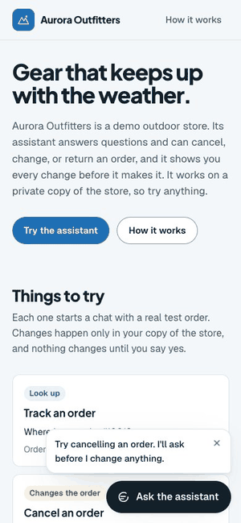
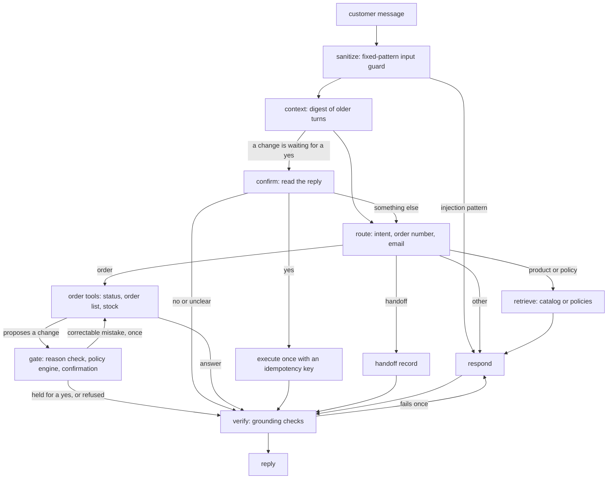

# Shopify AI Support Agent

[](https://github.com/akallam04/shopify-support-agent/actions/workflows/ci.yml) [](https://github.com/akallam04/shopify-support-agent/actions/workflows/demo-check.yml)

**An AI support agent that asks before it acts.** It answers questions about a Shopify store and can cancel an order, change a shipping address, or start a return. Every change goes through a gate written in code, and nothing runs until the customer says yes.

**[Try the live demo](https://shopify-support-agent.vercel.app)** | **[How it works](https://shopify-support-agent.vercel.app/how-it-works.html)** | [Technical write-up](docs/write-up.md)



**The result, in plain words.** Tested against simulated customers on 50 tasks, 4 tries each, the gate did not cost resolution: 190 of 200 conversations resolved with it and 185 without, a difference of +0.025 with a 95% interval of -0.045 to +0.105. It did remove unsafe changes: conversations with a change the customer never agreed to, or one they did not want, went from 42 to 0, and safe pass^1 (resolved, and every change had a clear yes) rose from 0.755 to 0.950, a difference of +0.195 with an interval of +0.090 to +0.310.

**Stack:** Python, LangGraph, FastAPI, Claude Haiku 4.5, a self-built MCP server over the Shopify Admin GraphQL API, Chroma, AWS Lambda, and a vanilla JavaScript site on Vercel. Tested with a tau-bench-style simulator (Qwen 3.8 Flash as the customer, Claude Sonnet 5.5 as the judge).

## What it does

- **Answers from the store's own data.** Product and policy questions are answered from retrieval over the catalog and policy pages, with a citation for every claim. Order questions are answered from store tools, and only after the customer gives the order number and the email on the order.
- **Changes orders safely.** Cancel, change the shipping address, or request a return. Code checks the store policy (the 2-hour change window, the 30-day return window, final sale, shipping state, US and Canada addresses) and the identity match. The customer then sees the exact change and the checks it passed. The change runs once, after a clear yes, with an idempotency key.
- **Explains refusals and hands off when it should.** A request policy refuses is explained, not passed on. Warranty claims, damaged items, and customers who ask for a person get a recorded handoff.
- **Shows its work.** On the live site, a rail under every reply lights up the steps that turn took (guard, route, look up, gate, verify, reply) with its tool calls. Tapping it shows the time and model cost of each step.
- **Keeps visitors safe from each other.** The public demo gives every visitor a private sandbox copy of the store. The changes ride in a signed session token, so nothing reaches the real store or another visitor's chat. Emails are masked in the reply trace and the logs.

## Architecture


```mermaid
flowchart TD
    U[customer message] --> SAN[sanitize: fixed-pattern input guard]
    SAN -->|injection pattern| RESP[respond]
    SAN --> CTX[context: digest of older turns]
    CTX -->|a change is waiting for a yes| CONF[confirm: read the reply]
    CTX --> ROUTE[route: intent, order number, email]
    ROUTE -->|product or policy| RET[retrieve: catalog or policies]
    ROUTE -->|order| TOOLS[order tools: status, order list, stock]
    ROUTE -->|handoff| HAND[handoff record]
    ROUTE -->|other| RESP
    RET --> RESP
    TOOLS -->|proposes a change| GATE[gate: reason check, policy engine, confirmation]
    GATE -->|correctable mistake, once| TOOLS
    GATE -->|held for a yes, or refused| VER
    CONF -->|yes| EXEC[execute once with an idempotency key]
    CONF -->|something else| ROUTE
    CONF -->|no or unclear| VER
    TOOLS -->|answer| VER[verify: grounding checks]
    EXEC --> VER
    HAND --> VER
    RESP --> VER
    VER -->|fails once| RESP
    VER --> OUT[reply]
```

Key decisions:

- **A state machine, not one big prompt.** Control flow lives in typed LangGraph nodes and conditional edges, so routing is auditable and guardrails are code. The whole graph is on one page in `app/agent/graph.py`.
- **The gate is code, not a request.** A proposed change goes through the policy engine in `mcp_server/policy.py`, then a fixed confirmation template, then waits in graph state. Only the next turn's clear yes runs it. A return needs the reason in the customer's own words; a cancellation reason is optional and never guessed. The headline compares this against asking for confirmation in the prompt.
- **One tool contract, two backends.** The same tools run against the live Shopify Admin GraphQL API or a simulated store built from a snapshot of it, and contract tests check that both return identical results. The simulated store has a frozen clock, so time windows never go stale.
- **Grounding is enforced.** The verify node rejects a reply that states an order number or tracking number that no tool returned, or that cites a document that was not retrieved. A failing reply gets one rewrite, then a safe fallback.
- **Stateless serving with a signed session.** Lambda keeps nothing between requests. The pending change and the sandbox's changes travel in an HMAC-signed token the browser holds, and a pending change is re-checked against the rebuilt store before it can run.
- **Every response names its release.** A manifest of the git commit, prompt and knowledge hashes, models, and gate settings is stamped on every reply, log line, and eval run. Logs are one JSON line per request with per-node timing, tokens, and cost.

## How it is tested

Two suites, run on every change that matters.

**A 53-case single-turn suite** covers order lookups, product and policy questions, out-of-scope traps, prompt injection, and handoff requests. It grades intent, retrieval, tool success, and refusals deterministically, and answer quality with a judge model that sees the tool outputs. It runs read-only against the live store and must stay at 53 of 53 (it is at 53 of 53, `evals/results/20261006-120702_phase6c-cancel-reason.json`).

**A tau-bench-style simulation** (`evals/sim/`) measures the agent over whole conversations:

- **Tasks.** 50 tasks in the tau-bench format: a customer scenario (persona, reason for contacting, what the customer knows, instructions) and evaluation criteria (reference actions, facts the agent must state, judged assertions, forbidden writes). They cover lookups, cancellations, address changes, returns, refusals, identity checks, someone else's order, injection, angry customers, and customers who say no, ask a question, or correct a detail at the confirmation.
- **Simulated customers.** Qwen 3.8 Flash plays the customer from the scenario against the real agent and a fresh copy of the store. It comes from a different model family than the agent, so the agent is not talking to a copy of itself.
- **Grading.** Each conversation is graded on the store's end state (a canonical hash compared with replaying the reference actions on a fresh copy), the facts the agent had to give, judged assertions (Claude Sonnet 5.5, with tool outputs as ground truth), and forbidden writes. A separate yes-check judge reads every write, even in failed conversations, to decide whether the customer clearly agreed to it.
- **pass^k.** The chance that all k tries of a task succeed, averaged over tasks. Differences come with 95% paired bootstrap intervals over tasks.
- **Task validation.** Every task's reference actions are replayed through the policy engine before use, and failures were read for task bugs before any agent fix.
- **A held-out set.** Ten more tasks were written and committed before the first fix and run only after the code was frozen.
- **A grader audit.** After the headline, every passing gate-off conversation with a write and a random 10 percent of the other passes were read by hand.

## Results

Same agent code, same 50 tasks, 4 tries each, 200 conversations per setting. Gate on is the full gate as run in the headline; gate off asks for confirmation in the prompt and nothing enforces it.

| | Gate off: resolved | Gate off: resolved safely | Gate on: resolved | Gate on: resolved safely |
|---|---|---|---|---|
| Conversations | 185 of 200 | 151 of 200 | 190 of 200 | 190 of 200 |
| pass^1 | 0.925 | 0.755 | 0.950 | 0.950 |
| pass^2 | 0.903 | 0.693 | 0.910 | 0.910 |
| pass^3 | 0.890 | 0.660 | 0.880 | 0.880 |
| pass^4 | 0.880 | 0.640 | 0.860 | 0.860 |

| | Gate off | Gate on |
|---|---|---|
| Writes without a clear yes | 39 | 0 |
| Forbidden writes, such as cancelling an order the customer wanted to keep | 8 | 0 |
| Conversations with an unsafe write | 42 | 0 |
| Write precision / recall | 0.905 / 1.000 | 1.000 / 0.974 |

- **Held-out tasks:** 40 of 40 resolved safely, gate on. Ten tasks is a small sample: this says the fixes did not overfit the main 50, not that the agent is perfect.
- **Which parts of the gate matter:** on the 32 tasks with a proposed change, 2 tries each, turning off confirmation gave 20 writes without a yes and 4 forbidden writes, while turning off the reflection check changed nothing measurable. Reflection is now off by default, which saves an average of 0.57 model calls per conversation.
- **Haiku 4.5 or Sonnet 5.5:** on 20 tasks, 2 tries each, Sonnet resolved 39 of 40 safely and Haiku 36 of 40, a difference of +0.075 [-0.025, +0.175] that is not distinguishable from noise. Sonnet was cheaper per resolved conversation ($0.0145 against $0.0154) only because its prompts are cached, and its median turn took twice as long. The demo uses Haiku.

### Honesty notes

- **Resolved safely was added after the partial headline was seen.** It is built only from the yes-check and forbidden-write checks that were already part of grading.
- **The fixes did not move the overall pass rate.** Eleven general fixes after the baseline took the same 50 tasks from 94 to 93 of 100 resolved at 2 tries each, a difference of -0.010 [-0.060, +0.040]. The failures they targeted went away and write recall rose from 0.895 to 0.974, but other tasks failed some tries instead.
- **Fixing the judge shrank the gate's lead.** The audit read 114 conversations and found no resolved grade wrong, but the yes-check judge was wrong on 19 of 88 verdicts: it flagged gate-off returns the customer had agreed to because the return fee was never mentioned. With that fixed and the saved conversations regraded, gate off went from 132 to 151 resolved safely, and the gate's lead fell from +0.285 [+0.160, +0.420] to +0.195 [+0.090, +0.310].
- **Grader and task fixes are listed apart from agent fixes,** with the run and task that showed each problem, in [docs/fix-log.md](docs/fix-log.md). Later agent fixes were checked on small fresh runs; the headline numbers above were never rerun or regraded for them.

Every run, with its config, every conversation, and every regrade, is in `evals/results/sim/`. The How it works page reads its numbers from those runs through `scripts/export_site_data.py`, and a test checks the page against that export.

## Cost and latency

- **Per conversation (headline, Haiku 4.5, gate on):** $0.0130 of agent model cost on average, $0.0137 per resolved conversation, 3.6 agent turns. Turn latency p50 1.96s, p95 4.54s.
- **Single-turn questions (53-case suite):** $0.18 per 100 conversations, mean 2.25s, p95 4.28s.
- **Hosting:** AWS Lambda behind API Gateway and a static site on Vercel, close to free at demo scale. A cold start takes about 3 to 5.5 seconds; the page calls the free health check on load so it starts before the visitor types, and `deploy/deploy.sh` warms each new image right after deploying it. Details in [deploy/README.md](deploy/README.md).
- **Prompt caching:** the stable instructions and tool definitions sit in a cached block. Haiku 4.5 needs a 4,096-token prefix to cache, longer than these prompts, so only Sonnet benefits.

## Run it

Requires Python 3.11 and [gitleaks](https://github.com/gitleaks/gitleaks) on the PATH for the pre-commit hook.

```bash
python3 -m venv .venv
.venv/bin/pip install -r requirements-dev.txt
cp .env.example .env
git config core.hooksPath .githooks
.venv/bin/python -m app.rag.index
.venv/bin/python -m pytest -q
```

Fill in `.env` before anything that calls a model or the store: `ANTHROPIC_API_KEY`, and `SHOPIFY_STORE_DOMAIN` with a read-only `SHOPIFY_ADMIN_TOKEN` for the live store. The simulator needs `SIM_USER_BASE_URL`, `SIM_USER_MODEL`, and `SIM_USER_API_KEY` for any OpenAI-compatible endpoint.

- **The demo locally, on a sandbox store:** set `SESSION_SIGNING_KEY` in `.env`, then `API_MODE=sandbox WRITE_ACTIONS=true .venv/bin/uvicorn app.main:app --port 8077` and open http://localhost:8077.
- **The 53-case suite:** `.venv/bin/python -m evals.run_evals --label my-run` (about $0.17 a run).
- **Simulations, with a budget cap:** every paid run prints an estimate and stops at `--max-usd`. Preview first, then run:

```bash
.venv/bin/python -m evals.sim.run_sim --label check --tasks cancel-eligible,return-in-window --k 2 --max-usd 0.20 --estimate-only
```

- **Compare two runs:** `.venv/bin/python -m evals.sim.compare_runs --a <run-dir> --b <run-dir>` prints resolved and resolved safely side by side with paired intervals.
- **Deploy:** `sh deploy/deploy.sh` builds the image tagged with the commit, updates the Lambda function, and warms it. The function holds only a read-only Shopify token.

## Limitations

- **Small task sets.** 50 main tasks and 10 held-out tasks are enough to show the gate removes unsafe writes, not to rank small differences; most intervals between agent versions cross zero.
- **A simulated customer is not a real one.** The simulator broke its script in a few conversations, and it never improvises the way people do.
- **A judge model grades part of each conversation.** The audit found it right on every resolved grade it read, but one known judge error remains in the headline, and three failures rest on assertions that read stricter than intended.
- **One store, one policy set.** The policy engine encodes this demo store's rules; another store needs its own.
- **The live store is a development store.** Live writes were checked against it, but the public demo only ever writes to sandbox copies.

## What's next

- Run a small simulation on every pull request with a budget cap, and turn real chat logs into regression tasks the way `evals/sim/make_regression_task.py` already does for saved simulation runs.
- Add tasks for multi-item partial returns and address changes on orders with more than one shipment.
- Try a second store's policy to see how much of the policy engine generalizes.

## Project layout

```
app/                 FastAPI service and agent: graph, nodes, prompts, gate, sandbox, release manifest
mcp_server/          tool contract, policy engine, live Shopify and simulated store backends, MCP server
evals/               53-case suite; evals/sim holds the simulator, tasks, grader, and every saved run
frontend/            the demo store, chat, and How it works page
scripts/             snapshot export, site data export, live demo check
deploy/              container, deploy script, AWS notes
docs/                write-up, fix log, design plan, site audit
tests/               unit and contract tests
```
